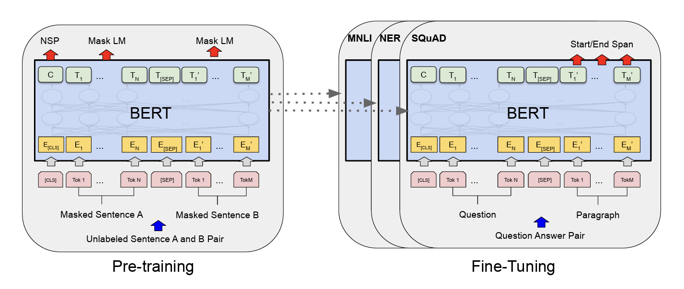
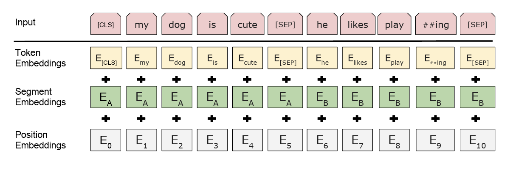
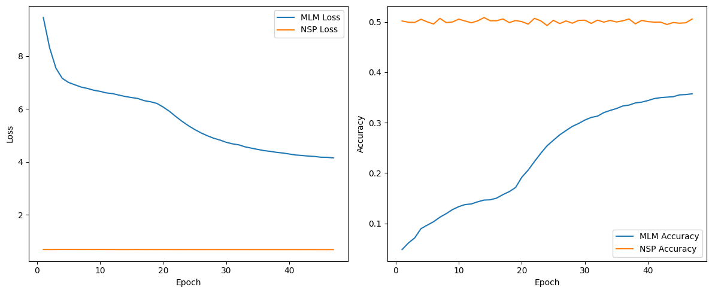
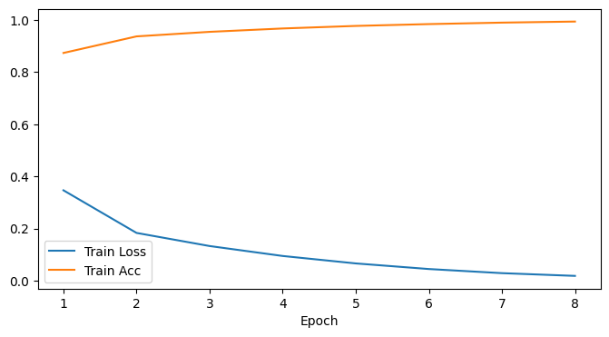

# BERT: Pre-training of Deep Bidirectional Transformers for Language Understanding

Pytorch implementation of the paper [BERT: Pre-training of Deep Bidirectional Transformers for Language Understanding](https://arxiv.org/pdf/1810.04805) by Jacob Devlin, Ming-Wei Chang, Kenton Lee, Kristina Toutanova. This paper demonstrates that deep bidirectional Transformer encoders can be pre-trained on large unlabeled text corpora using simple self-supervised objectives and then fine-tuned with minimal task-specific parameters to deliver state-of-the-art performance across a wide range of language understanding benchmarks. It introduces two novel pre-training tasks—Masked Language Modeling, which randomly masks tokens and predicts them based on both left and right context, and Next Sentence Prediction, which learns inter-sentence relationships—and shows that adding a lightweight output layer is sufficient to achieve breakthrough results on GLUE, SQuAD, and MultiNLI.

## Pre-training and Fine-tuning Pipeline

### 🔹 Pre-training (left panel)
- **Input Construction**  
  - Concatenate two segments (Sentence A and Sentence B).  
  - Add special tokens: `[CLS]` at the front, `[SEP]` between segments and at the end.  
- **Masked Language Modeling (MLM)**  
  - Randomly mask a subset of tokens (e.g. `Tₙ`, `T′ₘ`).  
  - Model predicts the original tokens using bidirectional context.  
- **Next Sentence Prediction (NSP)**  
  - Use the `[CLS]` token representation to classify whether Sentence B follows Sentence A.  

---

### 🔹 Fine-tuning (right panel)
- **Task-specific Inputs**  
  - Use same format: `[CLS]` + sequence(s) + `[SEP]`.  
- **Output Heads**  
  - **Classification tasks** (e.g. MNLI, NER):  
    - Apply a small feed-forward layer on the final `[CLS]` hidden state.  
  - **Span-prediction tasks** (e.g. SQuAD):  
    - Use two token-level classifiers to predict start and end positions.  
- **Parameter Updates**  
  - Fine-tune all pre-trained Transformer weights end-to-end along with the lightweight task heads.

##Input Representation

- **Token Embeddings**  
  Learnable vectors for each vocabulary piece (e.g. `[CLS]`, “my”, “dog”, “##ing”, `[SEP]`).

- **Segment Embeddings**  
  Two learnable vectors indicating Sentence A vs. Sentence B.  
  - Tokens in the first segment (up to the first `[SEP]`) use the “A” vector.  
  - Tokens in the second segment use the “B” vector.

- **Position Embeddings**  
  Learnable vectors encoding each token’s position in the sequence.

> **Final Input:** For each token, BERT adds together its token, segment, and position embeddings to form the input to the Transformer layers.

## Model Variants

- **BERTBASE**  
  - Layers (L): 12  
  - Hidden size (H): 768  
  - Attention heads (A): 12  
  - Total parameters: 110 M

## Configuration
```python
class BERTConfig:
    def __init__(self):
        self.vocab_size = 30522              # BERT-base vocab size
        self.d_model = 768                   # hidden size
        self.num_attention_heads = 12        # number of attention heads
        self.num_hidden_layers = 12          # number of encoder layers
        self.max_position_embeddings = 512   # maximum sequence length
        self.num_segments = 2                # sentence segment types (A, B)
        self.hidden_dropout_prob = 0.1       # dropout probability
        self.intermediate_size = 3072        # feed-forward inner layer size
        self.learning_rate = 5e-5            # optimizer learning rate
        self.weight_decay = 0.01             # weight decay for Adam
        self.eps = 1e-6                      # Adam epsilon
        self.batch_size = 32                 # training batch size
        self.max_epochs = 47                 # total training epochs
        self.warmup_steps = 10000            # learning rate warmup steps
```
## Pre-training Performance
After 47 epochs of joint Masked Language Modeling (MLM) and Next Sentence Prediction (NSP)

- **MLM Loss:** 4.16  
- **NSP Loss:** 0.69  
- **MLM Accuracy:** 35.7%  
- **NSP Accuracy:** 50.6%  
- **MLM Perplexity:** 63.8
  
## MLM Prediction
```python
original = "Water freezes at " + "[MASK]" + " degrees Celsius."
predicted = "two"
reconstructed = "[CLS] water freezes at " + predicted + " degrees celsius . [SEP]"
```

## NSP Prediction
```python
Sentence A: She went to the store.
Sentence B: She bought some milk.
Predicted NSP Label: NotNext
```

## Fine-tuning Performance
- **Test Accuracy:** 0.9317


## Parameters

- **vocab_size** : int  
  Size of the BERT vocabulary (number of distinct wordpiece tokens, typically 30 522 for BERT-Base).

- **d_model** : int  
  Dimensionality of all token, position, and segment embeddings, and hidden representations (768 for BERT-Base).

- **num_attention_heads** : int  
  Number of parallel attention heads in each multi-head self-attention block (12 for BERT-Base).

- **num_hidden_layers** : int  
  Number of stacked Transformer encoder layers (12 for BERT-Base).

- **intermediate_size** : int  
  Inner dimensionality of the position-wise feed-forward network in each encoder block (3072 for BERT-Base).

- **max_position_embeddings** : int  
  Maximum sequence length supported by the model (e.g., 512).

- **num_segments** : int  
  Number of token-type (segment) embeddings (2 for Sentence A vs. Sentence B).

- **hidden_dropout_prob** : float between 0 and 1  
  Dropout probability applied after embeddings, attention weights, and feed-forward activations (0.1 for BERT-Base).

- **learning_rate** : float  
  Initial learning rate for the optimizer (e.g., 5e-5).

- **weight_decay** : float  
  Weight decay (L2 regularization) coefficient used by AdamW (e.g., 0.01).

- **eps** : float  
  Epsilon value for the Adam optimizer to improve numerical stability (e.g., 1e-6).

- **batch_size** : int  
  Number of training examples per batch (e.g., 32).

- **max_epochs** : int  
  Total number of training epochs (e.g., 47).

- **warmup_steps** : int  
  Number of learning-rate warmup steps before linear decay begins (e.g., 10,000).

## Differences from "Attention Is All You Need"
This project implements the **BERT** model, which builds upon the original **Transformer encoder architecture** introduced in *"Attention Is All You Need"* (Vaswani et al., 2017), 

### Architecture Differences
- **Encoder-only Model**
- **No Causal Masking**
- **Segment Embeddings**

### Pretraining Objectives
- **Masked Language Modeling (MLM)**
  - BERT randomly masks input tokens and learns to predict them, enabling **bidirectional context learning**.
- **Next Sentence Prediction (NSP)**
  - BERT learns sentence relationships by predicting whether a second sentence follows the first in the original text.
